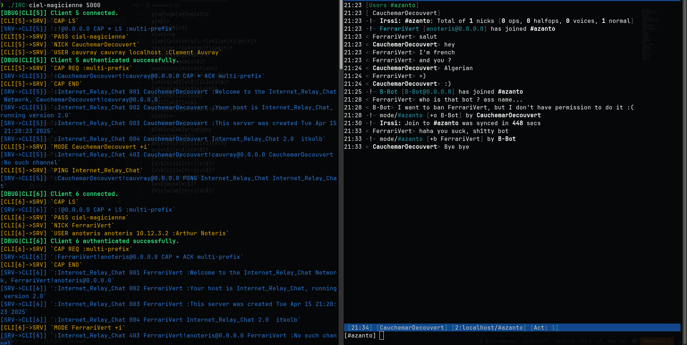

<p align="center">
	<a href="https://github.com/ayogun/42-project-badges"></a>
</p>

<h1 align="center">
	ft_irc
</h1>

<p align="center">
	<b><i>Internet Relay Chat</i></b><br>
	<b><i>By <a href="https://github.com/ft-NotArt">NotArt</a>, <a href="https://github.com/kaveOO">kaveOO</a> and <a href="https://github.com/BLQuatre">BLQuatre</a></i></b><br>
</p>

## Introduction
The goal of this project was to implement an IRC (Internet Relay Chat) server that can handle multiple clients, manage channels, and respect the core rules of the IRC protocol. This project focuses on socket programming, client-server communication, and efficient resource management.

## Features
- **Channels Management**: Operators, topic, ban, invite, password...
- **File Transfer**

## Installation & Setup
1. Clone the repository
	```sh
	git clone https://github.com/ft-NotArt/IRC
	cd IRC
	```

2. Build the project
	```sh
	make
	```

3. Start the server
	```sh
	./IRC <password> <port>
	```

4. You can choose your client, here's an example with [irssi](https://irssi.org/)
	```sh
	irssi -c localhost -n <nick> -w <password> -p <port>
	```

## Ban Bot
We made a bot that request a ban upon detecting a [badword using regex](./bot/badwords.txt).

To setup and launch the bot, follow these instructions:
```sh
cd bot
make
./Bot <password> <port> [ip]
```

## Example


